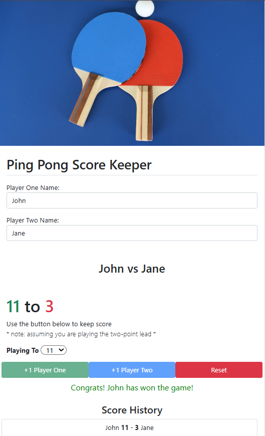

# score_keeper

A simple and interactive ping pong score keeper built with HTML, Bootstrap and JavaScript.
This project allows two players to keep track of their scores in a game, with an option ti set the winning score
and reset the game at any time.

## Features

- Live score tracking for two players
- Configurable winning score
- Game ends with a two-point lead rule
- Easy reset functionality
- Responsive design using Bootstrap

## Technologies used

- HTML5
- CSS3 (via Bootstrap)
- JavaScript (Vanilla)

### How to Use

- Select the target score from the dropdown
- Click the +1 Player One or +1 Player Two buttons to increment scores
- When a player reaches the target score and leads by at least two points, the game ends.
- Click the reset button to start a new game.
- The names of the players are written done in the score history part and stay there until refreshing the page.

## Potential Upgrades 
Here are a few ways this project can be improved and extended: 
- Dark Mode Toggle
- Sound effects: Play a sound when a player scores or wins
- Timer: Add a countdown or stopwatch for timed matches
- Multiple game modes: Include modes like best of-3, best-of-5 etc.

  Looking forward to expend my knowlegde in JS and to soon work on some upgrade of it. 

## Contributing

Feel free to fork the repository and submit pull requests.
